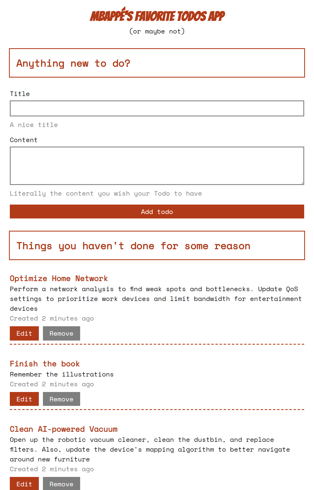
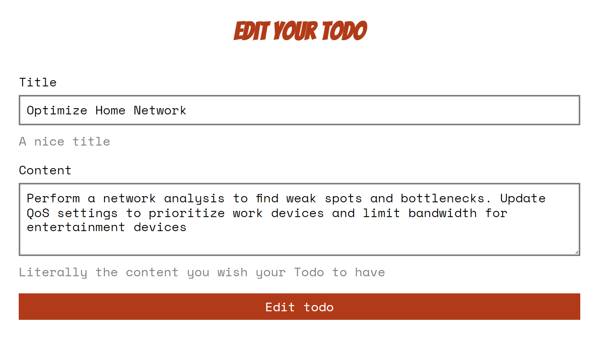

# Svelte Todo App

### How to run the app
```bash
# Make sure submodules are updated/fetched
git submodule update --init --recursive

# Run services
docker-compose up -d
```

This will provide all the required services. The web app can be found at http://localhost:5001 and the API at http://localhost:4000.

### Description

This app is an exploration of the SvelteKit framework and the Playwright framework for testing by developing a simple todo app with two views `index` and `todo/:id/edit`:

**Main page** 


---
**Edit todo page** 


### Main features

* SvelteKit SSR, Form Actions, Progressive Enhancement.
* CRUD todos.
* Error page just in case.
* E2E Testing with Playwright.
* 100% Mbappé's favorite todo app.

### How to run tests
Make sure everything is running in docker and then run `npm run test`.

### Main technologies used

* SvelteKit
* TypeScript
* Elixir
* Phoenix
* PostgreSQL

